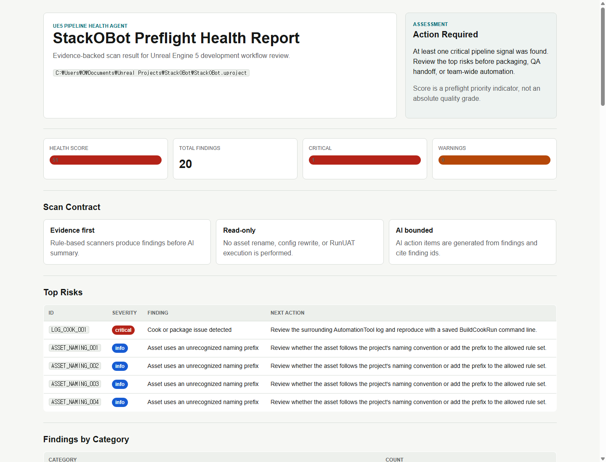

# UE5 Pipeline Health Agent

## Summary

UE5 Pipeline Health Agent는 Unreal Engine 5 프로젝트의 설정, 로그, 에셋 상태를 읽기 전용으로 분석하고, 개발 파이프라인의 위험 신호를 JSON, Markdown, HTML 리포트로 정리하는 Python 기반 자동화 도구입니다.

이 프로젝트는 UE5 게임 콘텐츠 제작물이 아니라, UE5 개발 과정에서 반복적으로 발생할 수 있는 preflight 점검과 로그 분석을 자동화하는 포트폴리오입니다.

## Problem

UE5 프로젝트에서는 빌드, Cook, Shader compile, DDC, asset validation, naming convention, large asset 관리처럼 여러 부서가 함께 영향을 받는 신호가 흩어져 있습니다.

문제는 오류 자체보다 다음 과정입니다.

- 로그가 길고 중요한 신호를 놓치기 쉽다.
- 정상적인 Display 로그와 실제 실패 로그를 구분해야 한다.
- 프로젝트별 naming prefix나 generated asset을 고려하지 않으면 false positive가 많다.
- CI나 협업 환경에서 사람이 매번 수동 점검하기 어렵다.

## Approach

도구는 Evidence First, AI Second 원칙으로 설계했습니다.

```text
UE5 project snapshot
  -> project scanner
  -> config scanner
  -> log scanner
  -> asset scanner
  -> findings.json
  -> health_summary.json
  -> ai_summary.json
  -> health_report.md
  -> health_report.html
```

먼저 deterministic scanner가 finding id와 근거를 생성하고, AI summary는 그 finding id를 참조해 역할별 action item을 정리합니다. 이 구조는 AI가 raw log를 자유롭게 추측하거나 과장하지 않도록 제한하기 위한 장치입니다.

## Implemented Features

- `.uproject` scanner
- `Config/*.ini` scanner
- `Saved/Logs/*.log` scanner
- `Content/**/*.uasset`, `Content/**/*.umap` scanner
- JSON, Markdown, HTML report generation
- mock AI summary provider
- role based action items
- `--fail-on critical/warning/info` CI exit policy
- pytest regression tests
- healthy, problem, official sample comparison snapshots

## Official Sample Verification

Epic 공식 Stack O Bot 샘플 프로젝트를 실제로 생성하고 editor log를 스캔했습니다.



```text
Target: C:\Users\0\Documents\Unreal Projects\StackOBot\StackOBot.uproject
Findings: 20
Health score: 51
Critical: 1
Warning: 0
Info: 19
```

탐지된 대표 finding:

```text
LOG_COOK_001
AutomationTool exiting with ExitCode=1 (Error_Unknown)
BUILD FAILED
```

## Rule Calibration

공식 샘플에 적용하면서 처음에는 일부 정상 로그나 프로젝트 구조가 과하게 문제로 탐지되었습니다. 이후 다음과 같이 rule을 보정했습니다.

- 정상 AutomationTool 시작 로그는 critical에서 제외
- DDC와 Shader Display 로그는 warning에서 제외
- profiler DLL load failure를 missing asset reference에서 제외
- `__ExternalActors__`, `__ExternalObjects__` generated asset 경로 제외
- custom naming prefix는 warning이 아니라 info로 분류

이 과정은 단순히 스캐너를 만든 것이 아니라, 실제 UE 샘플에 적용하며 false positive를 줄이는 실무형 보정 경험으로 설명할 수 있습니다.

## Test Result

```text
11 passed
```

검증 항목:

- expected finding 생성
- healthy snapshot high score 유지
- JSON, Markdown, HTML, AI summary 생성
- AI summary가 unknown finding id를 참조하지 않음
- scanner가 sample project files를 수정하지 않음
- `--fail-on critical` exit code 동작

## Portfolio Value

이 프로젝트는 Chrono Studio 개발 자동화 엔지니어 공고의 다음 요구와 직접 연결됩니다.

- 게임 개발 전반에 활용되는 AI 도구 설계 및 개발
- 반복 작업 자동화 및 생산성 향상 시스템 구축
- AI Agent를 활용한 개발 워크플로우 최적화
- 내부 개발 생산성을 극대화하기 위한 AI Tooling 제작
- Unreal Engine 개발 환경에 대한 이해

## Resume Summary

UE5 Pipeline Health Agent는 Unreal Engine 5 프로젝트의 설정, 로그, 에셋 상태를 읽기 전용으로 분석해 BuildCookRun, DDC, shader, validation, asset hygiene 신호를 리포트화하는 Python 기반 개발 자동화 도구입니다. Epic 공식 Stack O Bot 샘플의 실제 editor log를 스캔해 AutomationTool 실패를 탐지했고, false positive를 줄이기 위해 scanner rule을 보정했습니다.
